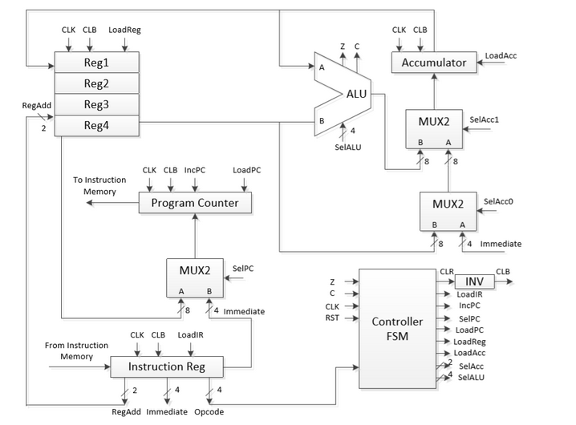
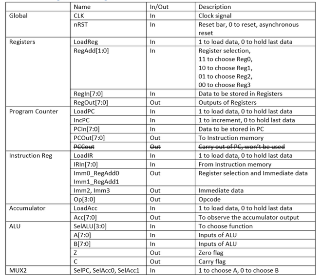

"# **_8-Bit-Microprocessor_**" 

**Block diagram of 8-Bit Microprocessor**

**Inputs and Outputs**

Before designing the 8-Bit Microprocessor, several components were designed. These includes 

1) Inverter

2) Full Adder

3) NAND Gate

4) 1-Bit ALU

5) 8-Bit ALU

6) CPU

7) Controller

