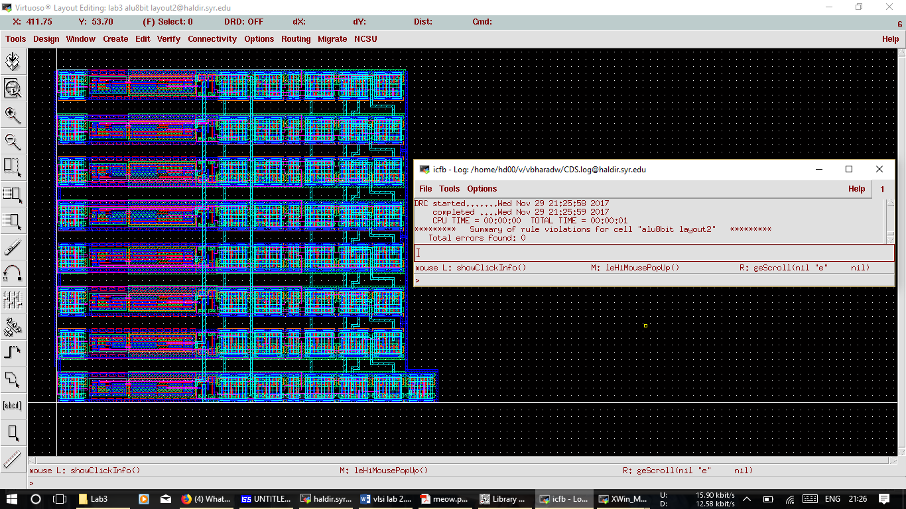

**_8-Bit-Microprocessor_**

**Block diagram of 8-Bit Microprocessor**

**Inputs and Outputs**

Before designing the 8-Bit Microprocessor, several components were designed. These includes 

1) Inverter

2) Full Adder

3) NAND Gate

4) 1-Bit ALU

5) 8-Bit ALU

6) CPU

7) Controller

**INVERTER**

Schematic of Inverter

DRC and LVS check for Inverter

**FULL Adder**

Layout of Full adder

**NAND Gate**

LVS and DRC check for NAND gate

**1-Bit ALU**

Schematic of 1-Bit ALU

Layout of 1-Bit ALU

LVS and DRC Check for 1-Bit ALU

**8-Bit ALU**

Schematic of 8-Bit ALU

LVS and DRC check

**CPU Design**

Schematic of CPU

Layout of CPU

LVS and DRC check for CPU

**Controller**

Schematic of Controller

LVS and DRC check for Controller

